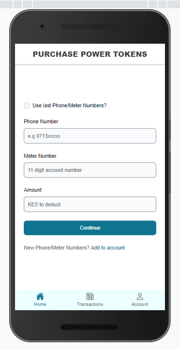
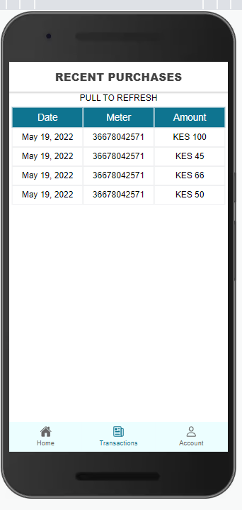
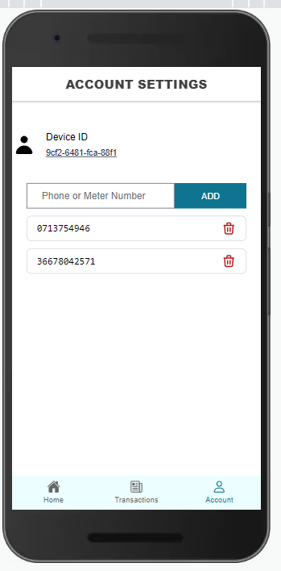

This is an app that a one can use to quickly pay for their power token units.

## APP SCREENS

## Getting started
These instructions will get you a copy of the project up and running in your local machine for development and testing purposes.

## Prerequisites
- [Git](https://git-scm.com/download/)
- [Node Js](https://nodejs.org/en/download/)
- [Angular CLI](https://angular.io/start)
- [Ionic CLI](https://ionicframework.com/docs/intro/cli)

### Setting up 
- Create a working space in your local machine
- Clone this [repository](https://github.com/nicksonlangat/mythicals-app.git) `git clone https://github.com/nicksonlangat/mythicals-app.git`
- Navigate to the project directory
- Install depedencies `npm install`
- Run the local server `ionic serve`
- Go to `localhost:8100` and view in mobile interface

### Homepage

User can fill the form to initiate a payment transaction:

 

### History Page

This page displays past user transactions.

 

### Account Page

A user can save their frequent phone and meter numbers for ease of reference.

 

### Extra Features
Export transaction history - Not fully complete